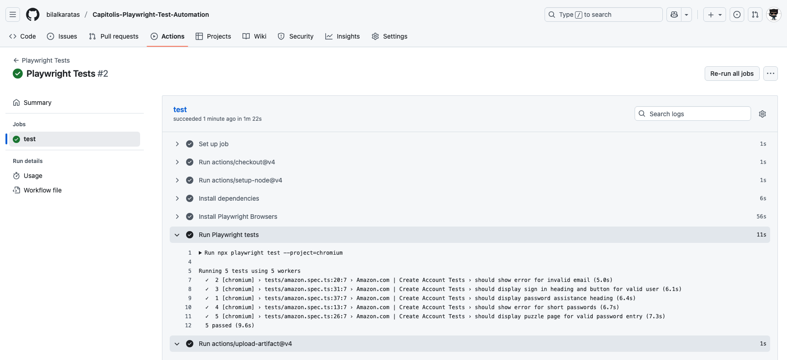

# Playwright Test Automation for Capitolis

## Assignment Overview
This project contains automated UI tests for the Amazon "Create Account" functionality, developed as part of the Capitolis home assignment.

## Tools & Technologies Used
- **Test Framework**: Playwright
- **Programming Language**: TypeScript
- **Browser Support**: Chromium, Firefox, Safari
- **Reporting**: HTML, JSON and XML reports


## 🚀 Quick Start

**Install Plugin**
> Playwright Test for VSCode

**Clone the repository and run following commands:**

  - `npm install`
  - `npx playwright install`  (to download browsers)

<br>

*Good to have:*
  - `sudo npm install -g playwright`  (Optional - Install Playwright globally)

<br>

### Report Artifacts Configuration

Configure what artifacts are captured during test execution in your `playwright.config.ts`:

```typescript
export default defineConfig({
  use: {
    // Video recording options
    video: 'retain-on-failure',    // 'off' | 'on' | 'retain-on-failure'
    
    // Screenshot capture options  
    screenshot: 'only-on-failure', // 'off' | 'on' | 'only-on-failure'
    
    // Trace recording options
    trace: 'retain-on-failure',    // 'off' | 'on' | 'retain-on-failure' | 'on-first-retry'
    
  },
});
```

## Running Tests in GitHub

This framework contains [playwright.yml](.github/workflows/playwright.yml) GitHub Actions workflow which is designed to manually run Playwright tests on a selected browser.

When triggered, it will execute the test suite for the browser chosen by the user (Chromium, Firefox, or WebKit). After executing the tests, it uploads the Playwright HTML report as an artifact so the test results can be easily reviewed or downloaded.

### Sample Test Result




## Running Tests in the Local Environment

To run the tests locally, use:

> npm run test

This command triggers the test script defined in the `scripts` section of your [package.json](package.json) file.

### Sample [Test Result](playwright-report)

