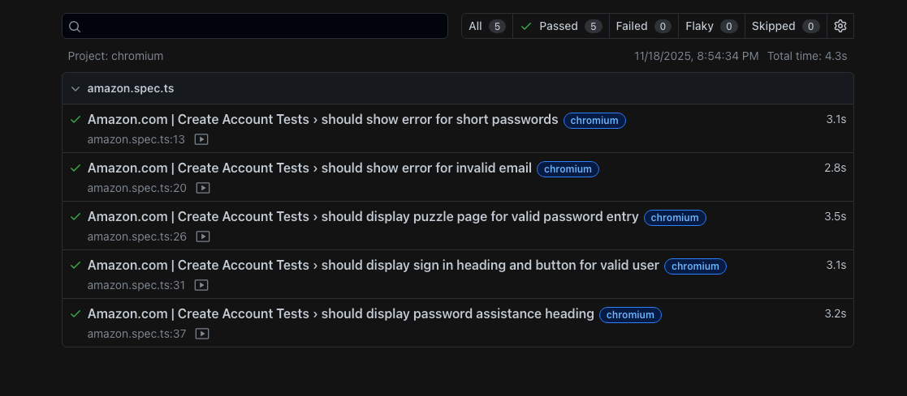

# Playwright Test Automation for Capitolis


## 🚀 Quick Start

**Install Plugin**
> Playwright Test for VSCode

**Clone the repository and run following commands:**

  - `npm install`
  - `npx playwright install`  (to download browsers)

<br>

*Good to have:*
  - `sudo npm install -g playwright`  (Optional - Install Playwright globally)

<br>

### Report Artifacts Configuration

Configure what artifacts are captured during test execution in your `playwright.config.ts`:

```typescript
export default defineConfig({
  use: {
    // Video recording options
    video: 'retain-on-failure',    // 'off' | 'on' | 'retain-on-failure'
    
    // Screenshot capture options  
    screenshot: 'only-on-failure', // 'off' | 'on' | 'only-on-failure'
    
    // Trace recording options
    trace: 'retain-on-failure',    // 'off' | 'on' | 'retain-on-failure' | 'on-first-retry'
    
  },
});
```

## Running Tests

to run tests:

> npm run test

## test result


# Amazon Create Account UI Automation Tests

## Assignment Overview
This project contains automated UI tests for the Amazon "Create Account" functionality, developed as part of the Capitolis home assignment.

## Tools & Technologies Used
- **Test Framework**: Playwright
- **Programming Language**: TypeScript
- **Browser Support**: Chromium, Firefox
- **Reporting**: HTML and JSON reports

## Project Structure